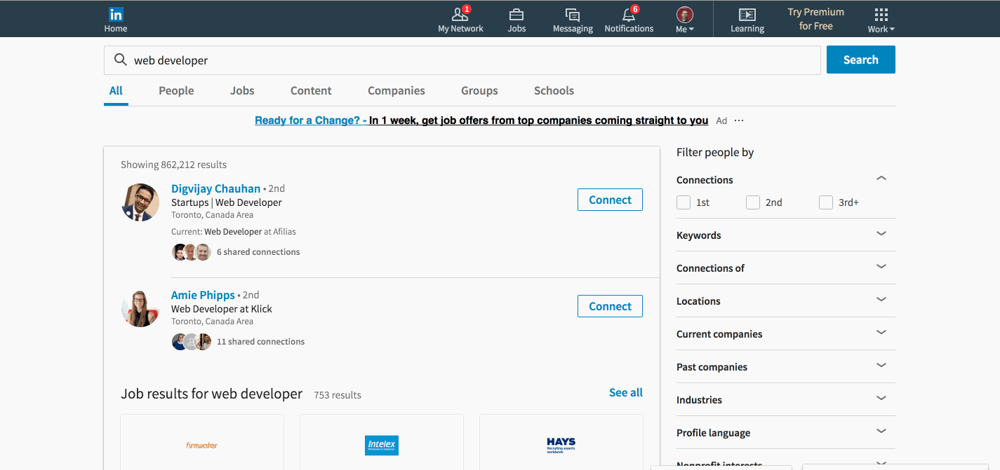
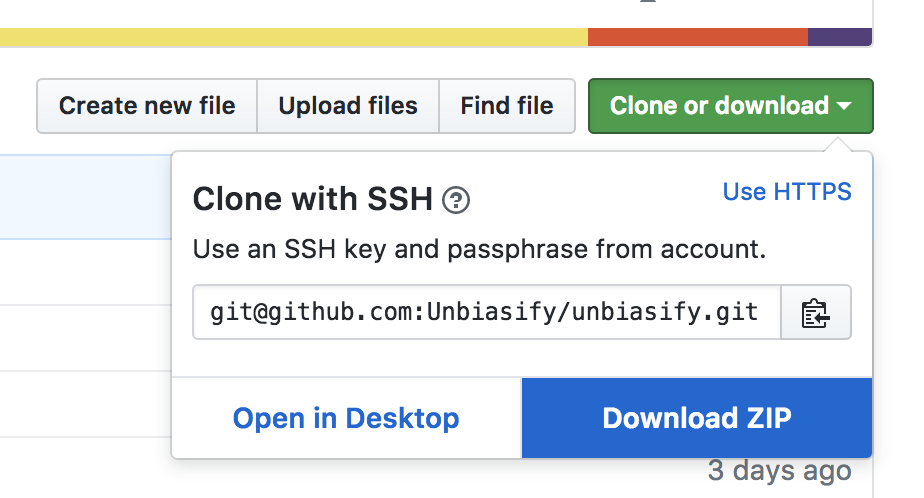
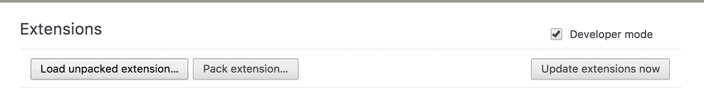
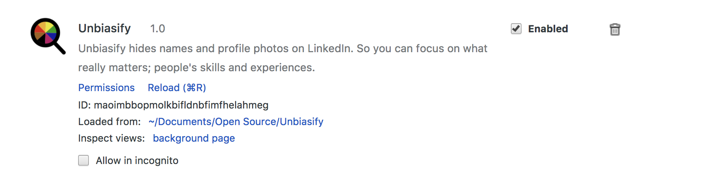
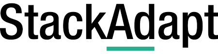

# Welcome to Unbiasify
Unbiasify is a tool to help reduce the amount of unconscious bias that people face when perusing many aspects of the internet.

The current functionality includes the ability to obfuscate/remove names and avatars from linkedin.

If you'd just like access to the tool, you can install it over at the chrome store 
<!-- TODO: Add a link -->

# How to use

After you have installed the extension you should be able to see a little unbiasify in your extensions list beside your address bar

Next; all you have to do is go to linked in and click that icon. Depending on what option you select in the dropdown all user names and/or images will be obsured, leaving you free to focus on what really matters; people's skills and experiences

# Supported Sites

* Linkedin -- free version only
* Angellist
* Twitter

# Local Installation Steps

### Get the code
The very first step is to download the project. You can either do this via git if you're comfortable with that:

`git clone git@github.com:Unbiasify/unbiasify.git`

or download the zip file from the button seen here:

### Install on chrome

In your address bar, navigate to: `chrome://extensions/`

In the top section you should see a checkbox for `Developer Mode`: Ensure that it is checked on.

After that; click the `Load Unpacked Extension...` button

Using the file explorer, locate and open the unbiasify directory wherever you cloned/unzipped it to. 

Assuming everything has gone well, you should now have Unbiasify listed in your extensions and you're all set!

# Contribution guidelines
On the way

# Special thanks
Everyone at Unbiasify would like to extend a special thanks to the following companies for their contributions and support.

